# Refatoração Arquitetural Automatizada com Custom Skills (`refactor-arch`)

Repositório contendo a implementação da **Custom Skill `refactor-arch`** e a refatoração arquitetural completa de 3 projetos legados com diferentes stacks tecnológicas (**Python/Flask** e **Node.js/Express**), migrando bases de código monolíticas, inseguras e desestruturadas para o padrão **MVC (Model-View-Controller)** com camada de **Serviços de Domínio**, validação por **Schemas/DTOs**, persistência relacional transacional e conformidade com **12-Factor App**.

---

## Sumário

1. [Visão Geral do Desafio](#visão-geral-do-desafio)
2. [Seção A — Análise Manual dos Projetos](#seção-a--análise-manual-dos-projetos)
   - [Projeto 1: code-smells-project (Python / Flask)](#projeto-1-code-smells-project-python--flask)
   - [Projeto 2: ecommerce-api-legacy (Node.js / Express)](#projeto-2-ecommerce-api-legacy-nodejs--express)
   - [Projeto 3: task-manager-api (Python / Flask / SQLAlchemy)](#projeto-3-task-manager-api-python--flask--sqlalchemy)
3. [Seção B — Construção da Skill (`refactor-arch`)](#seção-b--construção-da-skill-refactor-arch)
   - [Decisões de Design e Estrutura da Skill](#decisões-de-design-e-estrutura-da-skill)
   - [Catálogo de Anti-Patterns e Taxonomia](#catálogo-de-anti-patterns-e-taxonomia)
   - [Agnosticismo Tecnológico](#agnosticismo-tecnológico)
   - [Desafios Encontrados e Soluções](#desafios-encontrados-e-soluções)
4. [Seção C — Resultados e Auditoria](#seção-c--resultados-e-auditoria)
   - [Resumo Quantitativo dos Relatórios de Auditoria](#resumo-quantitativo-dos-relatórios-de-auditoria)
   - [Comparação Estrutural Antes / Depois](#comparação-estrutural-antes--depois)
   - [Checklist de Validação Preenchido](#checklist-de-validação-preenchido)
   - [Evidências e Logs de Execução](#evidências-e-logs-de-execução)
   - [Comportamento da Skill em Stacks Diferentes](#comportamento-da-skill-em-stacks-diferentes)
5. [Seção D — Como Executar](#seção-d--como-executar)
   - [Pré-requisitos](#pré-requisitos)
   - [Execução da Skill nos Projetos](#execução-da-skill-nos-projetos)
   - [Validação e Execução Local das Aplicações](#validação-e-execução-local-das-aplicações)
6. [Estrutura do Repositório](#estrutura-do-repositório)

---

## Visão Geral do Desafio

O objetivo deste projeto é demonstrar a construção de **Custom Skills** para agentes de Inteligência Artificial, capacitando-os a realizar diagnósticos arquiteturais profundos, auditorias de segurança e refatorações automatizadas em bases de código legadas sem perder o contexto de negócio ou quebrar contratos de API.

A skill `refactor-arch` opera em **4 fases sequenciais**:
1. **Fase 1 — Análise de Stack e Arquitetura:** Identificação automática de runtime, frameworks, banco de dados, arquivos-fonte e arquitetura inicial.
2. **Fase 2 — Auditoria e Detecção de Code Smells:** Cruzamento estático com catálogo de anti-patterns, classificação por severidade (*Critical, High, Medium, Low*), localização de arquivo/linha e **pausa mandatória para confirmação humana**.
3. **Fase 3 — Refatoração para Padrão MVC:** Reestruturação modular em camadas (*Models, Views/Routes, Controllers, Services, Schemas/DTOs, Middlewares, Configs*), eliminação de vulnerabilidades e preservação funcional.
4. **Fase 4 — Geração do Playbook Arquitetural:** Documentação dos 8 padrões de transformação com exemplos de código antes e depois (`docs/playbook_refatoracao.md`).

---

## Seção A — Análise Manual dos Projetos

Antes da automação via Skill, foi realizada uma auditoria manual detalhada nos 3 projetos legados do repositório para mapear vulnerabilidades, violações de design e oportunidades de melhoria.

---

### Projeto 1: `code-smells-project` (Python / Flask)

- **Domínio:** API RESTful de E-commerce (produtos, usuários, pedidos, itens e relatórios de faturamento).
- **Stack:** Python 3.12+, Flask 3.1.1, SQLite (`loja.db`) via `sqlite3` puro sem ORM.
- **Estrutura Original:** Monolítica dividida em apenas 4 arquivos (`app.py`, `controllers.py`, `models.py`, `database.py`) com acoplamento crítico.

#### Problemas Identificados Manualmente:

| # | Problema Identificado | Localização | Severidade | Justificativa do Impacto |
|---|-----------------------|-------------|------------|--------------------------|
| 1 | **SQL Injection Generalizado** | `models.py` (várias funções) | **CRITICAL** | Queries SQL montadas por concatenação direta de strings com parâmetros do usuário (`f"SELECT * FROM produtos WHERE id = {id}"`), permitindo extração de dados e bypass de autenticação. |
| 2 | **Endpoint de RCE no Banco (`POST /admin/query`)** | `app.py:58-69` | **CRITICAL** | Rota desprotegida que recebia JSON com comandos SQL arbitrários e os executava diretamente na base de dados de produção. |
| 3 | **Reset Destrutivo Desprotegido (`POST /admin/reset-db`)** | `app.py:72-85` | **CRITICAL** | Rota pública sem qualquer token de autenticação que executava truncagem de todas as tabelas, causando negação de serviço e perda total de dados. |
| 4 | **Exposição de Segredos e Senhas em Texto Plano** | `app.py:8`, `database.py`, `models.py` | **CRITICAL** | `SECRET_KEY` hardcoded, senhas gravadas em texto puro sem hash/salt no seed e devolvidas no payload de `GET /usuarios` e `GET /usuarios/<id>`. |
| 5 | **God Module (`models.py`)** | `models.py` (~314 LOC) | **CRITICAL** | Um único arquivo acumulava regras de 4 domínios (produtos, usuários, pedidos, relatórios), persistência SQL, envio de notificações e autenticação. |
| 6 | **Violação do MVC e Lógica nos Controllers** | `controllers.py` | **HIGH** | Controllers continham validação de domínio, regras de desconto e chamadas de notificação acopladas a objetos de requisição. |
| 7 | **Conexão SQLite Global Mutável** | `database.py` | **HIGH** | Objeto `db_connection` global único compartilhado entre threads (`check_same_thread=False`), inviabilizando concorrência e testes isolados. |
| 8 | **Queries N+1 no Carregamento de Pedidos** | `models.py:210-245` | **HIGH** | Ao listar pedidos, o sistema realizava consultas individuais secundárias para cada item e produto, degradando a performance. |
| 9 | **Tratamento Genérico de Erros e Logs via `print()`** | `controllers.py` | **MEDIUM** | Blocos `except Exception as e:` engolindo erros com `print(e)` e retornando mensagens genéricas com status 500 sem rastreabilidade. |
| 10 | **Magic Numbers em Regras de Desconto** | `models.py:280-310` | **LOW** | Limiares de faturamento (`10000`, `5000`, `1000`) e alíquotas (`0.10`, `0.05`, `0.02`) fixados no código sem constantes nomeadas. |

---

### Projeto 2: `ecommerce-api-legacy` (Node.js / Express)

- **Domínio:** API de LMS com fluxo de checkout de cursos, matrículas e relatórios financeiros.
- **Stack:** Node.js (CommonJS), Express 4.18.2, SQLite (`:memory:`) via callbacks.
- **Estrutura Original:** Monolítica centrada na classe `AppManager.js` com manipulação assíncrona por *Callback Hell*.

#### Problemas Identificados Manualmente:

| # | Problema Identificado | Localização | Severidade | Justificativa do Impacto |
|---|-----------------------|-------------|------------|--------------------------|
| 1 | **God Class (`AppManager.js`)** | `src/AppManager.js` (~300 LOC) | **CRITICAL** | Uma única classe gerenciava ciclo de vida do SQLite, DDL de tabelas, carga de seeds, Express routing, checkout, decisão de pagamento e relatórios. |
| 2 | **Segredos e Chave de Gateway no Código** | `src/utils.js:4-12` | **CRITICAL** | Chave live de gateway (`PAYMENT_GATEWAY_KEY = 'pk_live_supersecret_key_12345'`) e credenciais SMTP fixadas no arquivo versionado. |
| 3 | **Vazamento de Cartão de Crédito em Logs** | `src/AppManager.js:145` | **CRITICAL** | Número completo de cartão de crédito e chave secreta eram impressos no `console.log` a cada requisição de checkout (violação grave de PCI-DSS). |
| 4 | **Falta de Separação de Camadas MVC** | `src/app.js`, `src/AppManager.js` | **HIGH** | Inexistência de camadas distintas de Models, Views (formatadores JSON) e Controllers; lógica de apresentação e banco misturados. |
| 5 | **Pseudo-Criptografia Insegura (`badCrypto`)** | `src/utils.js:15-20` | **HIGH** | Algoritmo caseiro baseado em truncamento de Base64 e soma de caracteres ASCII, sem salt, vulnerável a inversão imediata. |
| 6 | **Operações Multi-Tabela sem Transação ACID** | `src/AppManager.js:150-190` | **HIGH** | No checkout, as inserções em `users`, `enrollments`, `payments` e `audit_logs` eram executadas em callbacks separados sem `BEGIN/COMMIT`. |
| 7 | **Estado Global Mutável em Memória** | `src/utils.js:23-28` | **HIGH** | Objetos `globalCache` e `totalRevenue` exportados e manipulados globalmente, gerando *state leakage* entre requisições. |
| 8 | **Queries N+1 no Relatório Financeiro** | `src/AppManager.js:210-260` | **MEDIUM** | Loop assíncrono consultando matrículas e pagamentos individualmente para cada curso cadastrado. |
| 9 | **Condição de Corrida no Boot (Boot Race Condition)** | `src/app.js` | **MEDIUM** | O servidor abria a porta HTTP via `app.listen()` antes de a criação do schema e a carga de dados no SQLite `:memory:` terminarem. |
| 10 | **Exclusão Incompleta de Usuário (Orphan Data)** | `src/AppManager.js:275-290` | **MEDIUM** | `DELETE /api/users/:id` excluía apenas a linha da tabela `users`, deixando matrículas e pagamentos órfãos no banco de dados. |

---

### Projeto 3: `task-manager-api` (Python / Flask / SQLAlchemy)

- **Domínio:** API RESTful de Gerenciamento de Tarefas com usuários, categorias, prioridades e notificações.
- **Stack:** Python 3.10+, Flask 3.0.0, Flask-SQLAlchemy 3.1.1, SQLite (`tasks.db`).
- **Estrutura Original:** Pastas parciais (`models/`, `routes/`, `services/`, `utils/`), porém com acoplamento e responsabilidades misturadas nas rotas.

#### Problemas Identificados Manualmente:

| # | Problema Identificado | Localização | Severidade | Justificativa do Impacto |
|---|-----------------------|-------------|------------|--------------------------|
| 1 | **Segredos Hardcoded no Código** | `app.py:13`, `services/notification_service.py:7-10` | **CRITICAL** | `SECRET_KEY = 'super-secret-key-change-in-production'` e credenciais de servidor SMTP embutidas nos arquivos-fonte. |
| 2 | **Hashing Inseguro em MD5 e Vazamento de Senhas** | `models/user.py:21, 27-32` | **CRITICAL** | Uso de MD5 sem salt para armazenar senhas de usuários e inclusão do campo `password` nas respostas públicas do método `to_dict()`. |
| 3 | **Token de Autenticação Fictício (Fake JWT)** | `routes/user_routes.py:185-211` | **CRITICAL** | Rota `/login` gerava a string estática `'fake-jwt-token-' + str(user.id)`, sem assinatura criptográfica, sem expiração e sem validação. |
| 4 | **Fat Routes / Quebra de MVC** | `routes/task_routes.py`, `routes/user_routes.py` | **CRITICAL** | Rotas acumulavam parsing HTTP, validação de payload, regras de negócio, transações ORM diretas e serialização de respostas JSON. |
| 5 | **Regras Duplicadas de Domínio (Shotgun Surgery)** | `task_routes.py`, `report_routes.py`, `helpers.py` | **HIGH** | Lógica de cálculo de tarefas atrasadas (`overdue`) e validações de prioridade replicadas em 4 arquivos diferentes. |
| 6 | **Queries N+1 na Listagem de Tarefas** | `routes/task_routes.py:14-59` | **HIGH** | Na listagem `GET /tasks`, eram disparadas consultas individuais `User.query.get` e `Category.query.get` para cada tarefa. |
| 7 | **CRUD de Categorias Deslocado no Módulo de Relatórios** | `routes/report_routes.py:157-223` | **MEDIUM** | Rotas de gerenciamento de `/categories` implementadas dentro do arquivo de relatórios analíticos, misturando domínios. |
| 8 | **Código Morto e Dependências Não Utilizadas** | `requirements.txt`, `services/notification_service.py` | **MEDIUM** | `marshmallow` e `python-dotenv` declarados mas não usados; `NotificationService` nunca era invocado pelas rotas. |
| 9 | **Uso de API Depreciada (`datetime.utcnow`)** | Vários arquivos em `models/`, `routes/`, `seed.py` | **LOW** | Utilização de `datetime.utcnow()`, depreciado desde o Python 3.12 em favor de `datetime.now(timezone.utc)`. |
| 10 | **Política Fraca de Validação de Senha** | `utils/helpers.py:12` | **LOW** | Permissão de senhas com apenas 4 caracteres (`MIN_PASSWORD_LENGTH = 4`) sem regras de complexidade. |

---

## Seção B — Construção da Skill (`refactor-arch`)

### Decisões de Design e Estrutura da Skill

A Skill foi desenhada com foco em **modularidade, clareza instrucional e independência de stack**. Ela é estruturada da seguinte forma:

```text
.claude/skills/refactor-arch/ (ou .cursor/skills/refactor-arch/)
├── SKILL.md                          # Instrução principal do agente (Workflow de 4 fases)
├── references/
│   ├── anti_patterns_catalog.md      # Catálogo estruturado de 12+ anti-patterns e soluções
│   └── issues_severity.md            # Matriz de decisão de severidade (Critical → Low)
└── templates/
    ├── project_analysis.txt          # Template de saída da Fase 1 (Stack & Mapeamento)
    ├── project_issues.txt            # Template de saída da Fase 2 (Relatório de Auditoria)
    └── refactoring_results.txt       # Template de saída da Fase 3 (Resultado do Refactor)
```

1. **`SKILL.md` como Orquestrador de Processo:**
   - Define o contrato de entrada e saída de cada fase.
   - Força o agente a executar uma análise estática antes de tentar alterar arquivos.
   - **Controle Humano Obrigatório:** Ao final da Fase 2, o agente obrigatoriamente pausa a execução e aguarda confirmação explícita do usuário antes de iniciar a Fase 3.
2. **Separação entre Regras de Classificação e Catálogo de Padrões:**
   - `references/issues_severity.md` fornece critérios objetivos para enquadrar cada problema em *CRITICAL*, *HIGH*, *MEDIUM* ou *LOW*.
   - `references/anti_patterns_catalog.md` fornece os marcadores de detecção no código, o impacto arquitetural e a estratégia recomendada de refatoração para MVC.
3. **Playbook de Refatoração Padronizado (Fase 4):**
   - Garante que cada projeto refatorado gere seu próprio [`docs/playbook_refatoracao.md`](./code-smells-project/docs/playbook_refatoracao.md) contendo os 8 padrões concretos de transformação com snippets de código *Antes* e *Depois*.

---

### Catálogo de Anti-Patterns e Taxonomia

O catálogo de anti-patterns cobre 5 grandes áreas de qualidade e arquitetura de software:

```mermaid
graph TD
    A[Catálogo de Anti-Patterns] --> B[Arquiteturais]
    A --> C[Segurança & Config]
    A --> D[Banco de Dados & I/O]
    A --> E[Qualidade & Manutenibilidade]
    A --> F[Tratamento de Erros]

    B --> B1[God Object / Fat Controller - CRITICAL/HIGH]
    B --> B2[Lack of Separation of Concerns - HIGH]
    B --> B3[Tight Coupling - HIGH]
    B --> B4[Misplaced Responsibilities - MEDIUM]

    C --> C1[Hardcoded Secrets / 12-Factor - CRITICAL]
    C --> C2[Insecure Cryptography / MD5 - CRITICAL]
    C --> C3[Fake / Broken Authentication - CRITICAL]
    C --> C4[Sensitive Data Exposure in Logs - CRITICAL]

    D --> D1[SQL Injection / String Concat - CRITICAL]
    D --> D2[N+1 Queries - HIGH]
    D --> D3[Non-Transactional Multi-Writes - HIGH]

    E --> E1[Shotgun Surgery / Duplicated Logic - HIGH]
    E --> E2[Long Methods / Blob Procedures - MEDIUM]
    E --> E3[Deprecated APIs - LOW]

    F --> F1[Bare Except / Print Logging - MEDIUM]
    F --> F2[Silently Ignored Errors - MEDIUM]
```



---

### Agnosticismo Tecnológico

Para garantir que a Skill funcionasse de forma idêntica em **Python/Flask** e **Node.js/Express**, foram adotados os seguintes princípios:

- **Instruções Baseadas em Padrões e Não em Sintaxes:** A Skill instrui o agente a identificar responsabilidades conceituais (ex: *"onde as queries SQL são montadas"*, *"onde os status HTTP são retornados"*, *"onde as regras de cálculo residem"*), mapeando-as para a camada correspondente no MVC.
- **Heurísticas Universais de Descoberta:** Regras para identificar gerenciadores de dependências (`package.json`, `requirements.txt`, `pyproject.toml`), rotas (`@app.route`, `app.get/post`, `express.Router`) e pontos de persistência (`sqlite3`, `SQLAlchemy`, `TypeORM`).
- **Preservação Universal de Contratos:** A Skill exige que nenhuma rota HTTP mude de URL, método ou formato de resposta JSON, independentemente da stack tecnológica.

---

### Desafios Encontrados e Soluções

| Desafio | Causa Raiz | Solução Adotada na Skill |
|---------|------------|--------------------------|
| **Contratos Legados Específicos** | No projeto Node.js, os parâmetros de entrada usavam abreviações (`usr`, `eml`, `c_id`, `card`) e respostas mistas de texto/JSON. | A camada de **View / Controller** foi instruída a atuar como *Adapter*, mantendo compatibilidade 100% com o contrato legado na entrada e saída, enquanto as camadas internas de Service e Model utilizam nomenclatura limpa e expressiva. |
| **Boot Race Condition no Node.js** | Criação assíncrona de tabelas no SQLite `:memory:` ocorria após a abertura da porta HTTP no Express. | A Skill estruturou o ponto de entrada em `src/server.js` com inicialização assíncrona (`async function bootstrap()`), garantindo que o servidor só receba requisições após o schema e seeds estarem prontos. |
| **Diferentes Abstrações de Persistência** | Projeto 1 usava SQLite nativo, Projeto 2 usava SQLite callbacks e Projeto 3 usava SQLAlchemy ORM. | A Skill definiu o papel conceitual da camada **Model** de forma agnóstica: encapsular queries SQL ou métodos ORM, garantindo que controllers e services nunca acessem diretamente objetos de banco de dados. |

---

## Seção C — Resultados e Auditoria

### Resumo Quantitativo dos Relatórios de Auditoria

| Projeto | Stack Tecnológica | CRITICAL | HIGH | MEDIUM | LOW | Total de Achados | Status Fase 2 |
|---------|-------------------|----------|------|--------|-----|------------------|---------------|
| **code-smells-project** | Python 3 / Flask 3.1 / SQLite | 5 | 5 | 4 | 3 | **17** | **Aprovado** (≥ 5 achados) |
| **ecommerce-api-legacy** | Node.js 18+ / Express 4.18 / SQLite | 3 | 5 | 5 | 2 | **15** | **Aprovado** (≥ 5 achados) |
| **task-manager-api** | Python 3 / Flask 3.0 / SQLAlchemy | 4 | 4 | 4 | 3 | **15** | **Aprovado** (≥ 5 achados) |

Os relatórios detalhados gerados pela Skill encontram-se em:
- [`reports/audit-project-1.md`](./reports/audit-project-1.md)
- [`reports/audit-project-2.md`](./reports/audit-project-2.md)
- [`reports/audit-project-3.md`](./reports/audit-project-3.md)

---

### Comparação Estrutural Antes / Depois

#### Projeto 1: `code-smells-project`

```text
[ANTES] Monólito Desestruturado             [DEPOIS] Arquitetura MVC em Camadas + Services
code-smells-project/                        code-smells-project/
├── app.py                                  ├── app.py (Entrypoint)
├── controllers.py                          ├── src/
├── models.py                               │   ├── app.py (App Factory / Composition Root)
├── database.py                             │   ├── config/settings.py (12-Factor Settings)
└── requirements.txt                        │   ├── db/database.py (Per-request SQLite lifecycle)
                                            │   ├── models/ (Persistência SQL parametrizada)
                                            │   │   ├── produto_model.py
                                            │   │   ├── usuario_model.py
                                            │   │   ├── pedido_model.py
                                            │   │   ├── relatorio_model.py
                                            │   │   └── mappers.py
                                            │   ├── services/ (Regras de Domínio Puras)
                                            │   │   ├── produto_service.py
                                            │   │   ├── usuario_service.py
                                            │   │   ├── pedido_service.py
                                            │   │   ├── relatorio_service.py
                                            │   │   └── notificacao_service.py
                                            │   ├── controllers/ (Adaptadores HTTP)
                                            │   │   ├── produto_controller.py
                                            │   │   ├── usuario_controller.py
                                            │   │   ├── pedido_controller.py
                                            │   │   ├── relatorio_controller.py
                                            │   │   └── health_controller.py
                                            │   ├── views/routes.py (Roteamento de URLs)
                                            │   └── middlewares/error_handler.py
                                            ├── tests/ (9 testes automatizados com pytest)
                                            └── docs/ (Relatórios e Playbook da Refatoração)
```

---

#### Projeto 2: `ecommerce-api-legacy`

```text
[ANTES] Monólito em Callbacks               [DEPOIS] Arquitetura MVC com Transações ACID
ecommerce-api-legacy/                       ecommerce-api-legacy/
├── src/                                    ├── src/
│   ├── app.js                              │   ├── server.js (Async Bootstrap & Process Entry)
│   ├── AppManager.js (God Class)           │   ├── app.js (Composition Root)
│   └── utils.js                            │   ├── config/settings.js (Configuração centralizada)
├── package.json                            │   ├── db/database.js (Async Helpers & withTransaction)
└── api.http                                │   ├── models/ (Queries SQL parametrizadas)
                                            │   │   ├── userModel.js
                                            │   │   ├── courseModel.js
                                            │   │   ├── enrollmentModel.js
                                            │   │   ├── paymentModel.js
                                            │   │   ├── reportModel.js
                                            │   │   └── auditLogModel.js
                                            │   ├── services/ (Casos de Uso e Domínio)
                                            │   │   ├── checkoutService.js
                                            │   │   ├── paymentGateway.js
                                            │   │   ├── passwordService.js (Scrypt + Salt)
                                            │   │   ├── reportService.js
                                            │   │   └── userService.js (Cascade Delete)
                                            │   ├── controllers/ (HTTP Orchestration)
                                            │   │   ├── checkoutController.js
                                            │   │   ├── reportController.js
                                            │   │   └── userController.js
                                            │   ├── views/httpResponses.js (Formatação View)
                                            │   └── routes/index.js (Mapeamento de Rotas)
                                            ├── docs/ (Relatórios e Playbook da Refatoração)
                                            └── .env.example
```

---

#### Projeto 3: `task-manager-api`

```text
[ANTES] Rotas Parciais (God Routes)         [DEPOIS] MVC + Schemas Marshmallow + Injeção
task-manager-api/                           task-manager-api/
├── app.py                                  ├── app.py (App Factory create_app)
├── database.py                             ├── database.py (Instância Central do SQLAlchemy)
├── seed.py                                 ├── config/settings.py (Configurações seguras)
├── models/                                 ├── models/ (Entidades com Métodos de Domínio)
├── routes/ (Lógica + SQL misturados)       │   ├── user.py (Werkzeug Hash, sem senhas no to_dict)
├── services/ (NotificationService morto)   │   ├── task.py (is_overdue centralizado)
└── utils/                                  │   └── category.py
                                            ├── schemas/ (Validação DTO com Marshmallow)
                                            │   ├── user_schema.py
                                            │   ├── task_schema.py
                                            │   └── category_schema.py
                                            ├── controllers/ (Casos de Uso e Transações)
                                            │   ├── auth_controller.py (Tokens itsdangerous)
                                            │   ├── user_controller.py
                                            │   ├── task_controller.py (Eager Loading joinedload)
                                            │   ├── category_controller.py
                                            │   └── report_controller.py
                                            ├── views/ (Blueprints HTTP Finos)
                                            │   ├── user_views.py
                                            │   ├── task_views.py
                                            │   ├── category_views.py
                                            │   ├── report_views.py
                                            │   └── health_views.py
                                            ├── services/notification_service.py (SMTP integrado)
                                            ├── middlewares/error_handler.py (AppError e Logs)
                                            └── docs/ (Relatórios, Playbook e Sumário)
```

---

### Checklist de Validação Preenchido

Para todos os 3 projetos, o checklist de aceite técnico foi 100% cumprido:

```markdown
## Checklist de Validação

### Fase 1 — Análise
- [x] Linguagem detectada corretamente (Python 3 / Node.js)
- [x] Framework detectado corretamente (Flask 3.1 / Express 4.18 / Flask 3.0 + SQLAlchemy)
- [x] Domínio da aplicação descrito corretamente (E-commerce / LMS / Task Manager)
- [x] Número de arquivos analisados condiz com a realidade

### Fase 2 — Auditoria
- [x] Relatório segue o template definido nos arquivos de referência
- [x] Cada finding tem arquivo e linhas exatos
- [x] Findings ordenados por severidade (CRITICAL → HIGH → MEDIUM → LOW)
- [x] Mínimo de 5 findings identificados por projeto (17 no P1, 15 no P2, 15 no P3)
- [x] Detecção de APIs deprecated incluída (datetime.utcnow no Python 3.12+)
- [x] Skill pausa e pede confirmação antes da Fase 3

### Fase 3 — Refatoração
- [x] Estrutura de diretórios segue padrão MVC rigoroso com camadas
- [x] Configuração extraída para módulo de config (sem credenciais hardcoded)
- [x] Models criados para abstrair acesso e persistência de dados
- [x] Views/Routes separadas para visualização, DTO e roteamento
- [x] Controllers concentram o fluxo da aplicação e orquestração
- [x] Error handling centralizado com logs estruturados
- [x] Entry point claro (app.py / server.js)
- [x] Aplicações iniciam sem erros
- [x] Endpoints originais respondem corretamente com preservação de contrato
```

---

### Evidências e Logs de Execução

As evidências de execução da Skill e dos testes de fumaça pós-refatoração estão documentadas nos seguintes arquivos:
- **Projeto 1:** [`code-smells-project/evidencias.md`](./code-smells-project/evidencias.md) — 9 testes unitários e de integração aprovados no `pytest`.
- **Projeto 2:** [`ecommerce-api-legacy/evidence.md`](./ecommerce-api-legacy/evidence.md) e [`ecommerce-api-legacy/api.http`](./ecommerce-api-legacy/api.http) — Testes de checkout, pagamentos recusados e relatórios consolidados.
- **Projeto 3:** [`task-manager-api/docs/summary.md`](./task-manager-api/docs/summary.md) — Boot da aplicação, carga de seed e validação de autenticação criptografada.

---

### Comportamento da Skill em Stacks Diferentes

1. **Em Monólitos Extremos (Python puro / SQLite):** A Skill foi capaz de desmembrar o arquivo `models.py` de mais de 300 linhas, separando lógica de apresentação, negócio e banco sem quebrar a API.
2. **Em Código Legado Baseado em Callbacks (Node.js / Express):** A Skill substituiu o callback hell por Promises estruturadas com `async/await`, eliminou race conditions na inicialização e introduziu transações com rollback automático.
3. **Em Bases Parcialmente Estruturadas (Flask / SQLAlchemy):** A Skill identificou que as rotas acumulavam responsabilidades indevidas, extraindo validações para Marshmallow e desacoplando as regras de negócio em Controllers dedicados.

---

## Seção D — Como Executar

### Pré-requisitos

- **Ambiente:** Linux ou macOS com terminal bash/zsh.
- **Node.js:** Versão 18 ou superior com `npm`.
- **Python:** Versão 3.10 ou superior (testado com 3.12 e 3.14) com `pip` ou `uv`.
- **Ferramenta de IA (opcional para rodar a skill):** Claude Code CLI (`claude`), Cursor IDE, ou Gemini CLI.

---

### Execução da Skill nos Projetos

Para executar a auditoria e refatoração automatizada em qualquer um dos projetos:

```bash
# Executando no Projeto 1 (code-smells-project)
cd code-smells-project
claude "/refactor-arch"

# Executando no Projeto 2 (ecommerce-api-legacy)
cd ../ecommerce-api-legacy
claude "/refactor-arch"

# Executando no Projeto 3 (task-manager-api)
cd ../task-manager-api
claude "/refactor-arch"
```

---

### Validação e Execução Local das Aplicações

#### 1. Executando o `code-smells-project` (Porta 5003)

```bash
cd code-smells-project

# Criar e ativar ambiente virtual
python3 -m venv .venv
source .venv/bin/activate

# Instalar dependências
pip install -r requirements.txt
pip install -r requirements-dev.txt

# Executar suíte de testes automatizados
pytest -v

# Iniciar a API
python app.py
```

*Smoke Tests via curl:*
```bash
curl -s http://127.0.0.1:5003/health
curl -s http://127.0.0.1:5003/produtos
curl -s -X POST http://127.0.0.1:5003/login \
  -H 'Content-Type: application/json' \
  -d '{"email":"joao@email.com","senha":"123456"}'
```

---

#### 2. Executando o `ecommerce-api-legacy` (Porta 3000)

```bash
cd ecommerce-api-legacy

# Instalar dependências
npm ci

# Iniciar o servidor
npm start
```

*Smoke Tests via curl:*
```bash
# Relatório financeiro (agregação sem N+1)
curl -s http://localhost:3000/api/admin/financial-report

# Checkout aprovado
curl -s -X POST http://localhost:3000/api/checkout \
  -H 'Content-Type: application/json' \
  -d '{
    "usr": "Aluno Teste",
    "eml": "aluno@teste.com",
    "pwd": "senhaSegura123",
    "c_id": 1,
    "card": "4111222233334444"
  }'

# Checkout recusado (cartão inválido)
curl -s -i -X POST http://localhost:3000/api/checkout \
  -H 'Content-Type: application/json' \
  -d '{
    "usr": "Aluno Recusado",
    "eml": "recusado@teste.com",
    "c_id": 1,
    "card": "5111222233334444"
  }'
```

---

#### 3. Executando o `task-manager-api` (Porta 5000)

```bash
cd task-manager-api

# Criar e ativar ambiente virtual
python3 -m venv .venv
source .venv/bin/activate

# Instalar dependências
pip install -r requirements.txt

# Popular o banco inicial
python seed.py

# Iniciar o servidor
python app.py
```

*Smoke Tests via curl:*
```bash
# Health Check
curl -s http://localhost:5000/health

# Login e obtenção de token assinado
curl -s -X POST http://localhost:5000/login \
  -H 'Content-Type: application/json' \
  -d '{"email":"joao@email.com","password":"12345678"}'

# Listar tarefas com relacionamentos carregados (sem N+1)
curl -s http://localhost:5000/tasks

# Relatório executivo consolidado
curl -s http://localhost:5000/reports/summary
```

---

## Estrutura do Repositório

```text
.
├── README.md                              # Documentação consolidada do desafio
│
├── reports/                               # Relatórios de Auditoria da Fase 2
│   ├── audit-project-1.md                 # Auditoria do code-smells-project
│   ├── audit-project-2.md                 # Auditoria do ecommerce-api-legacy
│   └── audit-project-3.md                 # Auditoria do task-manager-api
│
├── code-smells-project/                   # Projeto 1 — Python/Flask (E-commerce API)
│   ├── .claude/skills/refactor-arch/      # Definição e referências da Skill
│   ├── src/                               # Código-fonte refatorado em MVC
│   ├── tests/                             # Suíte de testes automatizados (pytest)
│   ├── docs/                              # Relatórios e Playbook de Refatoração
│   └── app.py
│
├── ecommerce-api-legacy/                  # Projeto 2 — Node.js/Express (LMS Checkout API)
│   ├── .cursor/skills/refactor-arch/      # Definição e referências da Skill
│   ├── src/                               # Código-fonte refatorado em MVC + Services
│   ├── docs/                              # Relatórios e Playbook de Refatoração
│   └── api.http
│
└── task-manager-api/                      # Projeto 3 — Python/Flask (Task Manager API)
    ├── .cursor/skills/refactor-arch/      # Definição e referências da Skill
    ├── config/, models/, views/, controllers/, schemas/, services/, middlewares/
    ├── docs/                              # Relatórios e Playbook de Refatoração
    ├── seed.py
    └── app.py
```

---

*Desenvolvido como entrega do desafio de Custom Skills e Refatoração Arquitetural.*